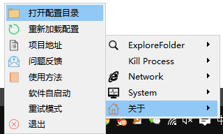

[](https://github.com/guoming0000/BatchRunTrayTool/releases/download/v17.7.17/2017-07-17.BatchRunTrayToolSetup.exe) [](https://opensource.org/licenses/MIT) [](https://www.qt.io)

Chinese to English Translated

# BatchRunTrayTool

# 软件快捷访问工具
# Software quick access tool

这是一款可以快捷启动各种文件（包括可执行文件）的软件，是快捷方式的集合。将快捷方式拖到软件目录下的config文件夹归类使用，可以让桌面洁净，配合软件的“重试模式”可以进一步减少日常工作中的反复点击。
This is a software that can quickly start various files (including executable files) and is a collection of quick ways. Dragging the quick way to the config folder under the software catalog can be classified and used to make the desktop clean, and the software's “ retest mode ” can further reduce repeated clicks in daily work.


## 本软件适合哪些人
## Who is suitable for this software

* 工作中经常要打开某些文件、文件夹。
* 工作中经常要跑某些脚本或者程序。
* 桌面洁癖者。

* Some documents and folders are often opened during work.
* Often run certain scripts or programs at work.
* Desktop cleaners.


## 使用该软件你可以
## You can use the software

* 把项目文档归到一起，快捷访问。（推荐将快捷方式放到config目录下）
* Put the project documents together and quickly visit. ( Recommend to put the quick way under the config catalog)

  
```
BatchRunTrayTool/BatchRunTrayTool.exe
BatchRunTrayTool/config/
BatchRunTrayTool/config/X项目
BatchRunTrayTool/config/X项目/X项目功能.word
BatchRunTrayTool/config/X项目/X项目时间计划.xls
BatchRunTrayTool/config/X项目/X项目脑图.xmind
BatchRunTrayTool/config/X项目/X项目图片.png
BatchRunTrayTool/config/X项目/X项目地址.html
```

* 把常用的工具放到一起，如开发软件、绘图软件
* 可以自己DIY，写bat脚本跑一些任务
* 可以为每一个文件夹或文件设置图标（不设置就显示系统默认图标）

* Put common tools together, such as software development, drawing software
* You can DIY yourself and write bat scripts to run some tasks
* The icon can be set for each folder or file (display the system default icon without setting)


## 软件运行截图：




## 简要说下“关于”中的几个功能：
## Briefly say “ about several functions in ”:

1. 打开配置目录：打开程序下的config目录，将快捷方式拖到这里，并重新加载即可看到软件的快捷入口。
2. 重新加载配置：软件自动重启，重新加载目录下的config配置
3. 软件自启动（可勾选）：勾选则添加本软件为开机自启动项，推荐大家勾选。默认关闭。
4. 重试模式（可勾选）：勾选则启动重试模式，打开某一个文件后，下来再需要重新打开只需要左键单击软件图标。取消勾选，可关闭该模式。默认关闭。

1.  Open the configuration catalog: Open the refig catalog under the program, drag the fast way here, and reprint to see the fast entrance of the software.
2.  Reloading configuration: The software automatically restarts, reprinting the configuration under the catalog
3.  Software self-startup (checkable): If you hook, add this software as the start-up item, and recommend everyone to hook up. Disclosure by default.
4.  Retrial mode (collectable): Hooking starts the retest mode. After opening a certain file, you need to reopen the left key single-hit software icon. Cancel the hook and close the model. Disclosure by default.


## 如何使用
## How to use


安装后，您最好打开BatchRunTrayTool.exe同级目录下的"__config-simple__"文件夹，浏览下一个简单的配置(config)是如何构成的。然后你可以将任何文件、快捷方式拖放到__config__文件夹中，重新加载后，这个软件可使你仅需要一二次点击就可打开它。

After installation, you'd better open the "__config-simple__" folder under the BatchRunTrayTool.exe peer catalog and browse how the next simple configuration (config) constitutes. Then you can drag any file and quick way into the __config__ folder. After reprinting, this software will allow you to open it with only one or two clicks.


了解__config-simple__是什么回事后，打开__config__可以了解更多的配置技巧：
After understanding what __config-simple__ is, open __config__ to learn more configuration skills:

1. **\_\_logo\_\_.png**是文件夹图标。
2. **程序\_\_logo\_\_.png**是程序的图标。（大部分程序有自己的图标）
3. **程序\_\_show\_\_**强调程序以可见方式运行（一般不需设置），对于.bat脚本可以看到命令行界面。
4. **文件夹\_\_seperator\_\_**使得菜单产生分隔符。

1. **\_\_logo\_\_.png** is a folder icon.
2. **program\_\_logo\_\_.png** is the icon of the program. ( Most programs have their own icons)
3. **Procedure\_\_show\_\_** emphasizes that the program operates in a visible way (generally not required), and the command line interface can be seen for the .bat script.
4. **File folder\_\_seperator\_\_** makes the menu separate.


## 已知软件限制
## Known software limitations

* 最多支持三层，config/第一层/第二层/第三层
* 不支持文件夹快捷方式
* 目前仅支持windows平台
  
* Support up to three levels, config/first level/second level/third level
* Do not support the shortcut of folders
* Currently only support the windows platform


## License

Copyright (c) BrightGuo.com. All rights reserved.

Licensed under the [MIT](LICENSE.txt) License.
